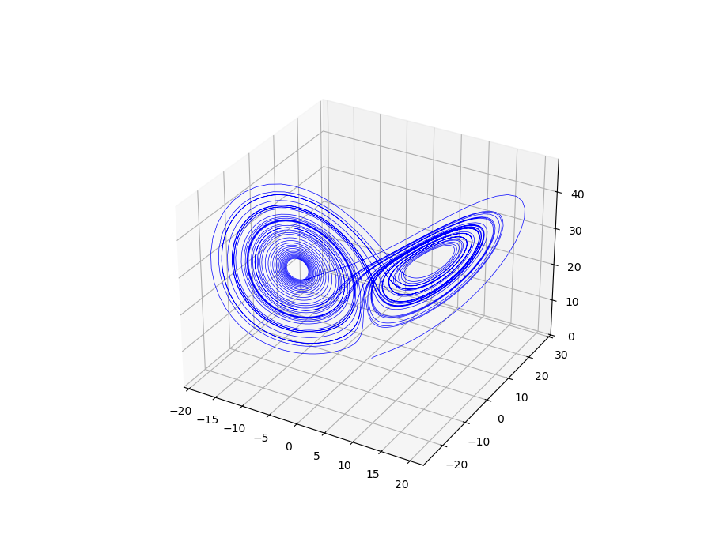
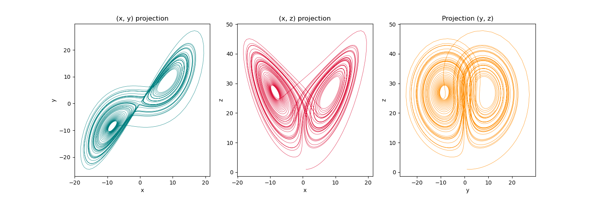
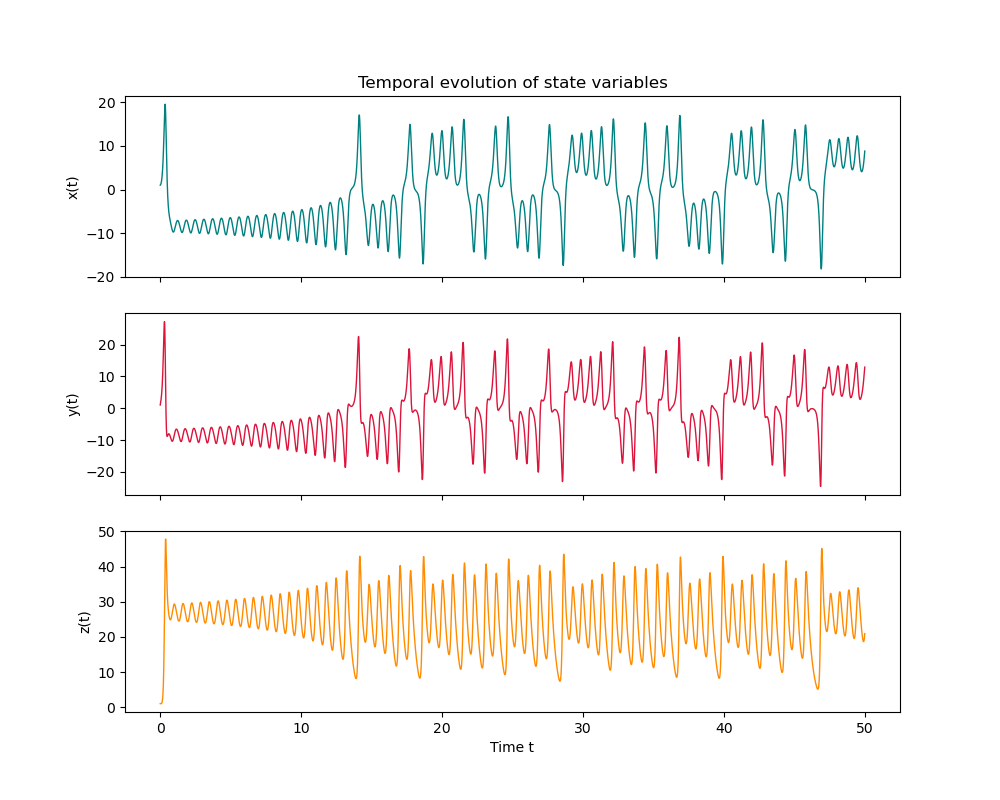
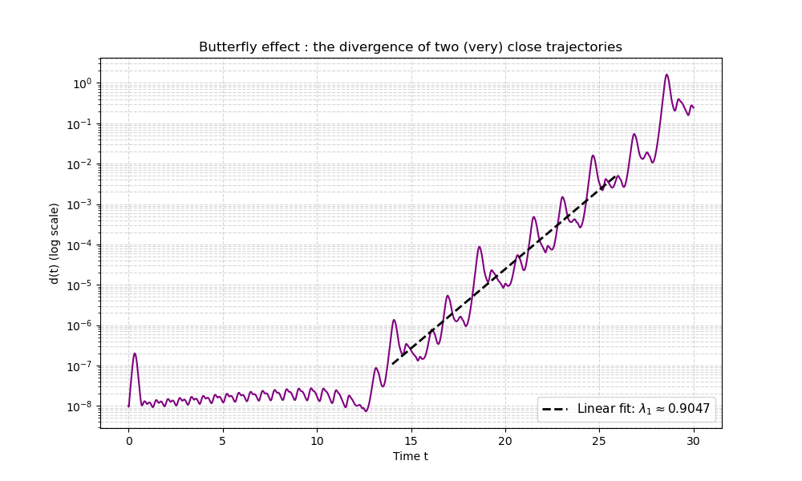

# Lorenz Attractor
Numerical exploration of the Lorenz system : RK4 integration, 3D visualization,  butterfly effect via Lyapunov exponent estimation.  Implementation in Python (NumPy/Matplotlib).

## Background

In 1963, meteorologist Edward Lorenz looks for a way of simplifying atmospheric convection. In the process, he discovers that a perfectly deterministic system of three coupled ODEs could exhibit unpredictable long-term behavior : the butterfly effect, foundational for Chaos theory. 

## The System

The Lorenz equations read :

dx/dt = σ(y - x)

dy/dt = x(ρ - z) - y

dz/dt = xy - βz

where σ is the Prandtl number, ρ the reduced Rayleigh number and β a geometric aspect ratio.

Following the canonical values used by Lorenz (himself following Saltzman), we set σ = 10, β = 8/3, ρ = 28.
The system admits three fixed points : the origin O = (0, 0, 0) and two symmetric points C± = (±√(β(ρ−1)), ±√(β(ρ−1)), ρ−1). For ρ > ρ_c ≈ 24.74, all three are unstable.

## Numerical method

Time integration is performed with a classical fourth-order Runge–Kutta scheme (RK4), which provides O(h⁴) global accuracy. A timestep of h = 0.01 is used (Lorenz's value).

## Results

### Attractor

Integrating from initial condition (1, 1, 1) over t ∈ [0, 50] reveals the characteristic butterfly shape: trajectories spiral around C+ and C−, switching between the two lobes in an aperiodic manner.

We can also take a look at 2D projections :

And finally the temporal evolution of state variables :

### Butterfly effect

Two trajectories starting only 10⁻⁸ apart in their x-coordinate are integrated in parallel. Their separation d(t) grows exponentially before saturating at the diameter of the attractor:

N.B. : The separation d(t) does not start growing exponentially from t = 0, but only after a plateau lasting until t ≈ 13. This plateau has no physical meaning: it is set by the floating-point truncation error of RK4 (≈ 10⁻¹² per step), which dominates the signal as long as the true exponential divergence remains below this floor.

A linear regression on the exponential growth window yields a Lyapunov exponent of λ₁ ≈ 0.9047, in good agreement with the published reference value of 0.9056 (Sprott, 2003) as we get an incredibly small 0.1% error.

## References

Lorenz, E. N., 1963: Deterministic Nonperiodic Flow. J. Atmos. Sci., 20, 130–141, https://doi.org/10.1175/1520-0469(1963)020<0130:DNF>2.0.CO;2.

Sprott, J. C. (2003). Chaos and Time-Series Analysis. Oxford University Press.
